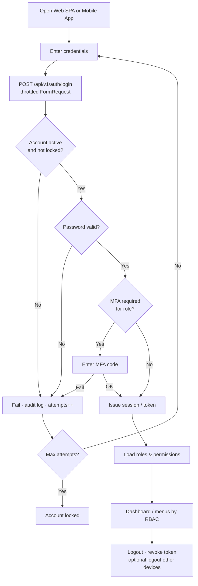
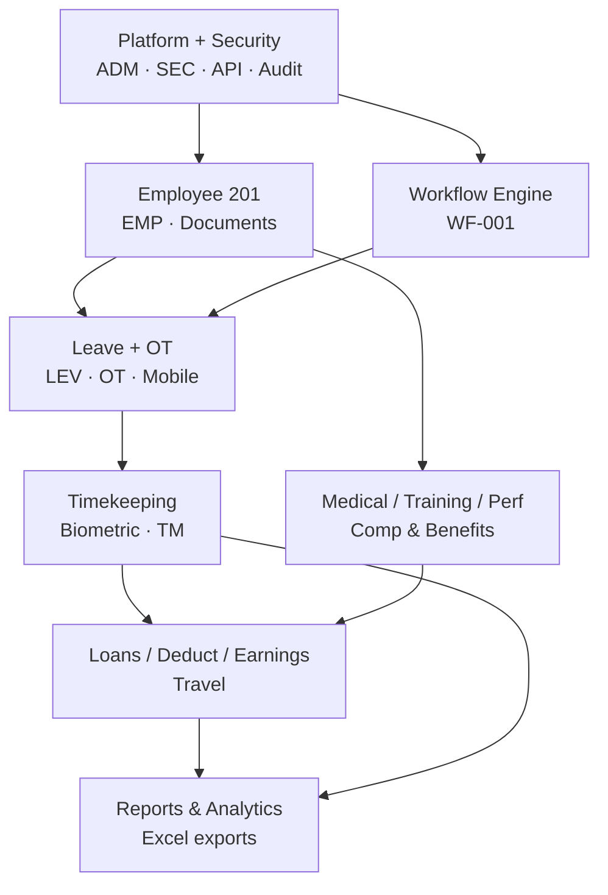
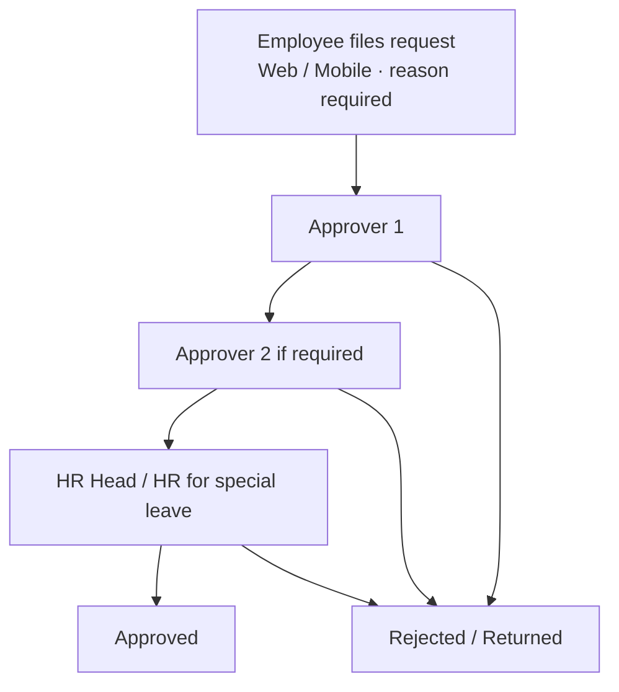
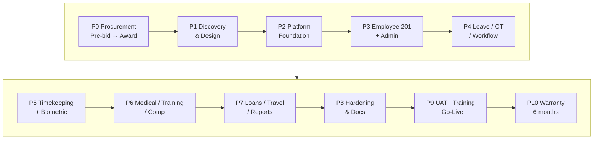
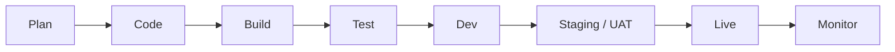

# PCSPC HRIS Flowcharts

In-app view of the delivery and feature flows (aligned with Cursor canvas `hris-flowcharts.canvas.tsx`).

Related:
- [Project Plan](/docs/project-plan)
- [Menu ↔ Module Map](/docs/modules)
- [Public API docs](/api-docs)

---

## Login & session

Sanctum web SPA (cookie) / mobile (Bearer) · MFA for privileged roles · RBAC menus.

---

## Modules (feature build sequence)

SOW A.3 + Annex A Must Haves · parallel tracks after platform foundation.

---

## Leave / OT approval

Annex A matrices vary by department/rank · reason required on filing.

---

## Delivery lifecycle

TOR + SOW · P0–P10 · ~36 weeks build + 6-month warranty.

---

## CI/CD promotion

SOW B.1–B.4 · no direct deploy to Live.

