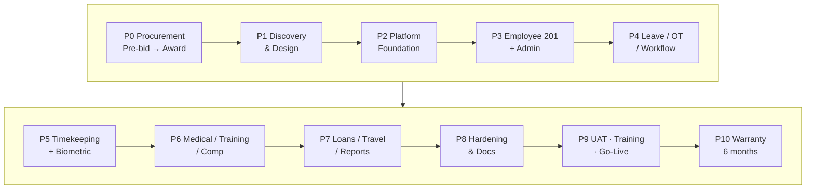
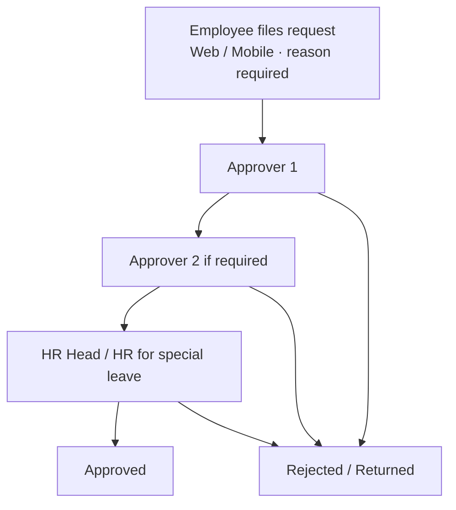
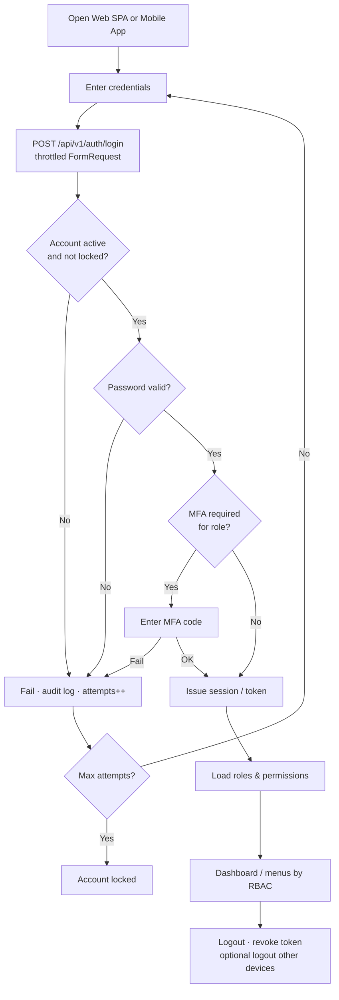

# PCSPC HRIS & Timekeeping — Project Plan (Start → Finish)

**PR No.:** P260166  
**Client:** Philippine Coastal Storage & Pipeline Corporation (PCSPC)  
**Sources:** `docs/hris-bidding/` (Invitation to Bid, TOR, Scope of Work, Annex A, Form of Proposal)  
**Proposed delivery:** ~36 weeks to Go-Live + **6 months warranty** (duration subject to PCSPC approval)

Interactive views:
- Plan: [`hris-project-plan.canvas.tsx`](/Users/landogz/.cursor/projects/Applications-XAMPP-xamppfiles-htdocs-PCSPC/canvases/hris-project-plan.canvas.tsx)
- Flowcharts: [`hris-flowcharts.canvas.tsx`](/Users/landogz/.cursor/projects/Applications-XAMPP-xamppfiles-htdocs-PCSPC/canvases/hris-flowcharts.canvas.tsx)
- App menu map: [`/docs/modules`](/docs/modules) ← sidebar routes wired to this module map (`config/navigation.php`)

### Delivery flowchart (Mermaid)

### CI/CD promotion flowchart

### Leave / OT approval flowchart

### Login & session flowchart

**Login design (Phase P2)**

| Concern | Approach |
|---------|----------|
| Web SPA | Laravel Sanctum cookie / stateful SPA auth |
| Mobile | Sanctum personal access token (Bearer) |
| API | Shared `/api/v1/auth/login`, `/logout`, `/me`, `/mfa/*` |
| MFA | Required for privileged roles (SEC-002 / ADM-004) |
| Password policy | Complexity, expiration, lockout (ADM-005) |
| Authorization | RBAC after login — hide UI **and** enforce Policies/Gates on API |
| Audit | Log success, failure, lockout, MFA events (AUD-001) |
| Transport | HTTPS/TLS only |

---

## 1. Project objective

Design, develop, customize, implement, and support an integrated **Human Resource Information System (HRIS)** and **Timekeeping System** covering employee records, leave, overtime, timekeeping/biometrics, medical, training, performance, compensation & benefits, loans/deductions/earnings, travel, workflow approvals, reporting, security, and post-implementation support.

---

## 2. End-to-end timeline

| Phase | Name | Window | Duration | Primary owner |
|-------|------|--------|----------|---------------|
| **P0** | Procurement & Award | Now → Award | ~4–6 weeks | PCSPC Procurement |
| **P1** | Kickoff, Discovery & Design | W1–W4 | 4 weeks | PM + BA + Architect |
| **P2** | Platform Foundation | W5–W7 | 3 weeks | Backend + DevOps |
| **P3** | Employee 201 + Admin/Security | W8–W11 | 4 weeks | Full-stack |
| **P4** | Leave, OT & Workflow Engine | W12–W16 | 5 weeks | Full-stack |
| **P5** | Timekeeping + Biometric | W17–W21 | 5 weeks | Full-stack + Integrator |
| **P6** | Medical, Training, Performance, Comp/Benefits | W22–W26 | 5 weeks | Full-stack |
| **P7** | Loans, Deductions, Earnings, Travel, Reports | W27–W30 | 4 weeks | Full-stack |
| **P8** | Hardening, CI/CD, Perf, Documentation | W31–W33 | 3 weeks | DevOps + QA |
| **P9** | UAT, Training & Go-Live | W34–W36 | 3 weeks | PCSPC + Contractor |
| **P10** | Warranty & Hypercare | Post Go-Live | **6 months** | Support Team |

---

## 3. Phase-by-phase plan

### P0 — Procurement (current)

**Key dates**
- Pre-bid: **August 4, 2026 (Tue) 10:00 AM**, Bldg. 1428 POL Pier Compound, Subic Bay Freeport Zone
- Bid deadline: tentatively **~1–2 weeks after pre-bid** (confirm at meeting)

**Submit**
- Envelope 1 — Technical (company profile, team/CVs, Gantt, methodology, compliance matrix, architecture & migration approach, testing/training/warranty plan, similar projects, SEC/business docs, signatory authority)
- Envelope 2 — Commercial (Form of Proposal, cost breakdown, payment terms, 120-day validity, audited FS) — **VAT Zero-Rated**

**Exit:** Contract, NDA, Performance Security / Advance Payment Bond (if any), kickoff date.

---

### P1 — Kickoff, Discovery & Design (W1–W4)

- Business process workshops (HR / IT / department heads)
- Freeze Annex A approval matrices (Leave, OT & OT Meal) by department and rank
- Document leave credit rules (VL tenure tiers, SL caps, special leaves, carry-over/cash)
- Holiday calendar rules (double pay, rest-day holiday = 8 hrs)
- Attendance computation rules from PCSPC
- Biometric device inventory & API/SDK access
- Data migration inventory (201, history, medical)
- GCP / env sizing for Dev, Staging(UAT), Live + dedicated PostgreSQL

**Exit:** System Design Document, Database Design (ERD), Technical Compliance Matrix, baseline Gantt, infra checklist signed.

---

### P2 — Platform Foundation (W5–W7)

Aligned to enterprise Laravel API SPA standards + SOW Part B:

- Laravel `/api/v1` + SPA shell (Axios, Tailwind, DataTables patterns)
- Sanctum auth, RBAC, MFA, password policy (ADM/SEC Must Haves)
- `ApiResponse` standard, FormRequest validation, Policies
- Audit logs, email notifications skeleton
- **PostgreSQL** schema baseline (migrate off local MySQL before Staging)
- Official PCSPC GitHub/repo branching (`feature` → staging → main)
- CI pipeline skeleton (build, unit tests, SAST hooks)
- Three environments wired: Dev → Staging → Live (no direct-to-Live)

**Exit:** Deployable shell on Dev/Staging; health API; user/role admin; secrets not in repo.

---

### P3 — Employee 201 + Administration (W8–W11)

- Employee master (Annex A personal/statutory fields)
- Dependents, education, employment history, training, medical stubs
- Historical salary / position / category tracking
- Org structure, holidays, shifts, master data, system parameters
- Document repository (DOC-001)
- Excel export

**Exit:** EMP + ADM UAT-ready on Staging with sample migrated data.

---

### P4 — Leave, Overtime & Workflow Engine (W12–W16)

- Configurable multi-level approvals (WF-001) per Annex A matrices
- Leave filing with **mandatory reason**; special leave includes HR
- VL / SL / Emergency / Bereavement / Maternity / Paternity / Solo Parent / VAWC / etc.
- OT + OT Meal filings
- Email notifications; **mobile app** self-service for Leave/OT
- HR ability to add/delete departments and customize special leave credits

**Exit:** End-to-end leave/OT paths accepted on Staging.

---

### P5 — Timekeeping + Biometric (W17–W21)

- Biometric device integration & auto-sync (TM-001)
- Attendance processing & accurate computation (TM-002)
- Holiday / rest-day / double-pay rules
- Manhour & OT summary reports
- Query optimization, indexing, connection pooling, load test for punch volume

**Exit:** Punch → computed attendance validated vs PCSPC sample period.

---

### P6 — Medical, Training, Performance, Comp & Benefits (W22–W26)

- Medical: APE, checkup, vaccines, reimbursement claims (limits, principal/dependent, attachments, Excel)
- Training & confirmation
- Performance records
- Compensation & benefits with history
- Encrypt/mask sensitive fields (medical, statutory, compensation) — DPA 2012

**Exit:** Module pack demoed; defects logged for UAT cycle 1.

---

### P7 — Loans, Deductions, Earnings, Travel, Reports (W27–W30)

- Loans, deductions, earnings management
- Travel history / travel requests + workflows
- Reports: employee, leave, OT, training, medical, deductions/earnings, attendance, manhours
- Customizable reports + Excel export

**Exit:** Feature freeze; only ≤ medium open defects.

---

### P8 — Hardening, CI/CD, Performance, Documentation (W31–W33)

- Full CI/CD: automated tests, quality gates, CD to Dev/Staging, gated Live deploy + rollback
- SAST/DAST, vulnerability assessment, backup/restore drill (BCP-001)
- Load/performance test report
- Full B.7 docs: architecture, logic flows, setup guide, dependencies, ERD, API docs, deployment runbook, user + admin manuals

**Exit:** Docs accepted; pipeline green; rollback tested.

---

### P9 — UAT, Training & Go-Live (W34–W36)

- Formal UAT on Staging; defect burn-down
- User training + manuals + knowledge transfer to PCSPC IT
- Data migration final cutover
- Live deploy **only after written PCSPC approval**
- Certificate of Final Acceptance → final payment trigger

**Exit:** Live stable; Final Acceptance issued.

---

### P10 — Warranty (6 months)

- Warranty from **Live Go-Live or Final Acceptance, whichever is later**
- Fix defects/bugs in original scope at **no additional cost**
- Separate quotation for post-warranty maintenance (PCSPC option)

---

## 4. Module map (Annex A + SOW A.3)

| Module / area | Req IDs | Phase |
|---------------|---------|-------|
| Administration | ADM-001…010 | P2–P3 |
| User Access & Security | SEC-001…002 | P2–P3 |
| Employee Management | EMP-001…006 | P3 |
| Leave Management | LEV-001…002 | P4 |
| Overtime Management | OT-001 | P4 |
| Timekeeping + Biometric | TM-001…002 | P5 |
| Workflow Engine | WF-001 | P4 |
| Document Management | DOC-001 | P3 |
| Notifications | NOT-001 | P3–P4 |
| Reporting & Analytics | RPT-001 | P7 |
| Audit & Compliance | AUD-001 | P2–P8 |
| API & Integration | API-001 | P2–P5 |
| Business Continuity | BCP-001 | P8 |
| DevOps & Governance | DEV-001 | P2–P8 |
| Medical Records | Annex A | P6 |
| Performance / Training / Comp & Benefits | SOW A.3 | P6 |
| Loans / Deductions / Earnings / Travel | SOW A.3 | P7 |
| Mobile App (self-service) | Annex A | P4–P7 |

---

## 5. Technical constraints (must follow)

| Topic | Requirement |
|-------|-------------|
| Database | **PostgreSQL** on dedicated DB server (SOW B.5) |
| Environments | Dev → Staging(UAT) → Live only |
| Cloud | PCSPC provides GCP (or chosen) IaC; contractor sizes & configures app |
| Repo | PCSPC-owned; daily/milestone pushes; PR reviews; no direct push to main |
| Security | RBAC, MFA, encryption in transit/at rest for sensitive data, audit logs, secrets mgmt, SAST |
| Privacy | Philippine Data Privacy Act 2012 (RA 10173) |
| API | REST APIs for integrations + mobile |
| IP | All project source code owned by PCSPC; readable, non-obfuscated |

**Local note:** Current XAMPP scaffold uses MySQL for convenience. Switch to PostgreSQL before Staging.

---

## 6. Contract deliverables

1. System Design Document  
2. Database Design  
3. Configured HRIS + Timekeeping application  
4. User Manual + Training Materials  
5. Test Results  
6. Architecture, logic flow, setup guide, dependencies list  
7. API documentation  
8. Deployment runbook + Administrator manual  
9. Complete readable source code, DB scripts, configs, repository access  
10. Warranty support (6 months)  
11. Certificate of Final Acceptance  

---

## 7. Suggested team

- 1 dedicated Project Manager  
- 1 Business Analyst / HRIS SME  
- 1 Solution Architect  
- 2–3 Backend (Laravel/API)  
- 1–2 Frontend (SPA + Tailwind)  
- 1 Mobile developer  
- 1 QA engineer  
- 1 DevOps / Security  

---

## 8. Initial risks

| Risk | Impact | Mitigation |
|------|--------|------------|
| Biometric vendor/API unknowns | High | Inventory in P1; early spike |
| Complex approval matrices | High | Config-driven workflows; HR sign-off in P1 |
| Leave credit / carry-over rules | Medium | Policy services + unit tests from Annex A |
| PostgreSQL/GCP not ready | High | Infra checklist at kickoff; block Live |
| Migration data quality | High | Staging rehearsal + dual-run week |
| Scope creep | Medium | Formal change requests (SOW B.13) |

---

## 9. Recommended payment gates (proposal)

1. Design sign-off (P1)  
2. Foundation on Staging (P2)  
3. Module pack A (P3–P4)  
4. Module pack B (P5–P7)  
5. UAT sign-off (P9)  
6. Final Acceptance (P9)  

Total Contract Price: **VAT Zero-Rated** (Form of Proposal). Proposal validity: **120 calendar days**.

---

## 10. Immediate next actions (this week)

1. Attend / prepare for **Pre-bid Aug 4, 2026** — clarify biometric brands, attendance formulas, mobile scope, GCP readiness, PostgreSQL hosting, data migration volumes.  
2. Draft Technical Compliance Matrix vs Annex A Must Haves.  
3. Prepare Gantt (this plan as baseline) + team CVs.  
4. Continue local Laravel scaffold; plan PostgreSQL migration path.  
5. Do **not** start production feature build until contract award (except proposal assets / demos).
